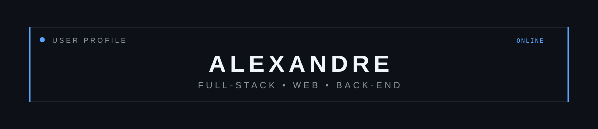
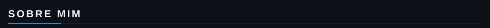
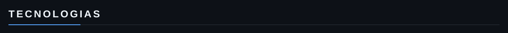
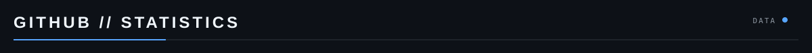
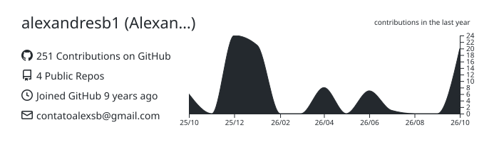
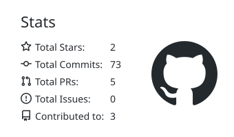
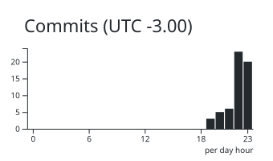

Bacharel em Engenharia de Software e Desenvolvedor Full Stack, com experiência no desenvolvimento, manutenção e evolução de sistemas web.

Iniciei minha carreira em 2023 como estagiário na área de desenvolvimento, atuando em Front-End e Back-End. Desde 2025, atuo como Desenvolvedor Full Stack, trabalhando principalmente com PHP, MySQL, JavaScript/jQuery, HTML, CSS, Bootstrap e integrações via API.

Tenho foco em desenvolvimento de soluções web, manutenção de sistemas e evolução contínua das aplicações, utilizando boas práticas de desenvolvimento e controle de versão com Git/Bitbucket.

  

  

  
  

